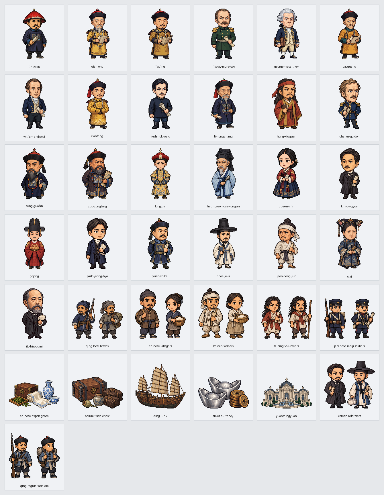

# 第9回「近代の東アジア①」実装記録

第2章「列強の侵略とアジアの変革」の第9回を、原文の4節・126場面（51・22・34・19）で掲載する。原書159ページの導入から178ページの年号・次回予告まで全20ページを保持する。第8回の末尾と第9回の冒頭を往復でき、目次では第2章の第9回として選べる。版は v0.119。

## 参照専用の原文

- 参照先：`sources/近代・現代/02_列強の侵略とアジアの変革/09_近代の東アジア①.md`
- SHA256：`298ad2bac1aa8824ecac56a7816497b46efda2cc72de85bdf29c293c96004018`
- 全618行、通常本文80行を接続した71段落。全20ページの表92行・補足85行・見出しも掲載する。
- 紙面接続は50→66、105→121、155→161、187→203、239→245、305→321、337→345、397→403、422→444の9組だけ。
- 実際の節見出しは26・287・351・508行。175ページの欄外見出しでは第4節に進まず、484行は第3節に残す。

原文は編集しない。本文は意味の切れ目で分け、切り分け位置を記録して、全71段落を重複・欠落なしで復元する。「厦」「門」、「不」「平等条約」の語中接続も余計な空白を加えず保持する。本文の太字452範囲・ルビ253範囲と色・下線は原書の属性を保つ。表の空欄、図内の文字、吹き出し、161・175ページの「＋α ちょっと寄り耳↑」、167ページの「近現代日本へのアプローチ 3」、178ページの年号と覚え方も独立した全文参照欄で表示する。

275行が明記する他回の原書138ページと、167ページ281行の独立コラムが明記する原書60ページへ接続する。第9回の原文補足には、次回予告を根拠に第10回の179ページ以降を追加しない。v0.120から通常の教材送りで第10回冒頭へ進み、第9回末尾へ戻れる。学習用に整理した45種類の説明図は原文の転載とは区別し、原文にない年号を追加しない。

## 地理と本人・集団・産品

地名243項目を、国や地域の代表位置・都市・海域・河川の参考点・建物・人物・制度に分ける。人物の辞書に固定座標を付けない。河川の一点は参考点であり、全流路や精密な境界線ではない。地理図は共通の経度32度・緯度24度の拡大上限を維持する。

「明治期」「説明」などの単語内部から王朝の「明」を拾わず、民族・言語を国家の所在地へ変えない。閔氏一族と閔妃、東学の開祖崔済愚と農民戦争の指導者全琫準、高宗と父の大院君、別の清朝皇帝を区別する。省略された地域は同じ親段落または直前の同じ節の本文から45場面・56地域記録に静的に引き継ぎ、根拠行を保存する。人物の旅程は補わない。

全49点を使用する。新作37点は本人25点、集団7点、産品・木造船・建物5点。既存12点は同じ本人5点と同じ一般的役割の道具・軍艦・工場7点。集団は清朝の民衆、太平天国の人びと、郷勇、清朝の正規軍、朝鮮の農民、急進開化派、明治期の日本軍を別々の絵とする。常勝軍を米国の南北戦争部隊に置き換えない。

アマーストは1816年の使節ウィリアム・ピット・アマーストを参照し、別人のジェフリー・アマーストを使わない。旧乾隆帝の絵は服装が合わないため使わず、今回の新作を使う。洪秀全・閔妃は認証された顔写真の再現とせず、時代と役割の模式図として画面にも説明する。過去の乾隆帝と、次回予告の孫文を今回の戦争に同席させない。神やイエスの姿を夢の描写として創作しない。本人は同じ時点の地図と模式欄へ二重に置かない。

画像の生成は指定のAntigravity経由Gemini 3.8 Flashへ依頼し10点を制作した。画像生成側の上限に達した後は、以前の利用者の別ツール続行承認に基づき27点を組み込み画像生成で制作した。全37点の透過・192画素への寸法調整はAntigravity経由Geminiへ依頼した。依頼文、保存先、元画像と出力の印は[画像の制作記録](image-assets.json)に保存する。

## 実際の移動と条約・改革

実際の動線は18本、姿の切替は0件。三角貿易の茶・綿布・アヘン3本、使節派遣、イギリス軍の北上、林則徐の追放、英仏連合軍の北上、咸豊帝の避難、ヤークーブ＝ベクと左宗棠の新疆進出、太平天国の進出、日本の台湾出兵、清軍の朝鮮出兵、開化派の亡命、1894年の清軍と日本軍の別々の出兵、日本軍の遼東進出を示す。

地点と地域代表間の概略方向であり、出港地・上陸地点・海路・人数は補わない。太平天国が広東出身の洪秀全によって広西の金田村で挙兵したことを混同しない。黄海海戦と遼東への陸上の進出を、同じ部隊の連続行程にしない。

片貿易と三角貿易、生活の銅銭と銀での納税、互市貿易と朝貢貿易、関税協定と関税自主権喪失、香港島と九竜半島南部、1858年と1885年の天津条約を別の段階として説明する。朝貢関係を直接統治と同じ意味にせず、台湾先住民についての清朝の回答と日本側の解釈を分ける。樺太・千島の領有変更、琉球処分、下関条約の工場設置権、三国干渉による返還、鉄道敷設の構想・権利を人や島・工場の移動にしない。中体西用の技術導入と政治改革の失敗も別の説明とする。

## 保存資料と検査

- `source-selection.json`：全618行の分類、原文の印、71段落と紙面接続。
- `reading-plan.json`：126場面の本文位置と、根拠付きの文脈地域。
- `name-review.json`・`entity-audit.json`：原文の名称、題名と本文・地図の対応。
- `routes.json`：出発・到着と本文根拠付きの18動線。
- `visual-plan.json`：49点と全場面の配置、本文・出典の印。
- `image-assets.json`：37新作の生成と調整、依頼文、保存先、37点の目視記録。

生成器は `--workspace`、`--published`、`--check` に対応する。本文検査は全行の分類を原文形式から独立に照合し、全段落復元、実見出しの区分、太字・色・ルビ、全表の空欄と文字、出典への到達、再生成一致を確認する。配置検査は全49点の使用、透過・描画範囲・画像の重複、本人名、場所、本文の非改変を確認する。

画面検査は読み上げと音声再生をページを開く前に停止し、幅1280・390と明暗両方で全126場面を504回表示する。原文全文・装飾・全20ページの補足、説明図・ドット絵・姓名、文字の不足や余分・重なり・はみ出し、実移動の始点・途中・終点・再表示・取消、権利の静止保持、目次・第8回との往復を対象とする。実行結果は[確認記録](validation.json)に記録する。

2026年10月4日、v0.119の確認では全126場面の504回表示、原書20ページと他回の60・138ページ参照、45種類の説明図、49画像を通過した。新作37点は顔・服装・役割・透過と余白を確認済み。本文全文・太字・色・ルビ、図表・コラム・年号の全文、実移動18本の途中・到着・再表示・取消、権利や思想の5場面の静止保持、目次と第8回との往復を確認した。読み込みエラー、名前の不足や余分、重なり、はみ出しは0件。第1回252回と第8回548回の再確認、全体・公開用検査、原文付きと保存済み記録からの再生成一致も通過した。参照専用の原文60ファイルと、作業開始時の未確定ファイル2件は非改変。
