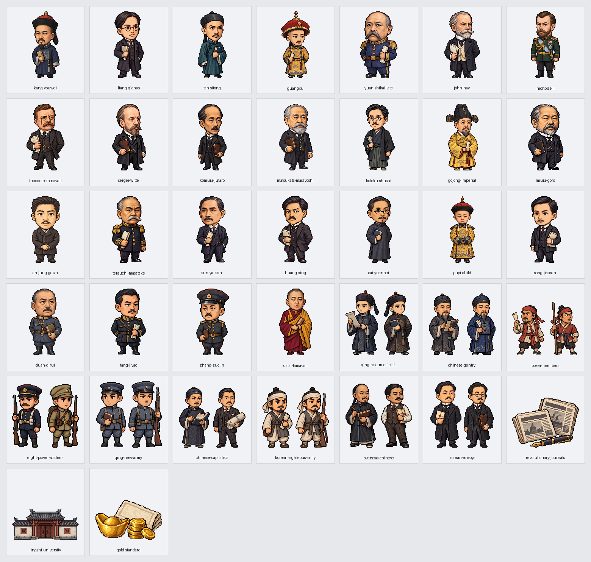

# 第10回「近代の東アジア②」実装記録

第2章の第10回を、原書の4節157場面（33・55・18・51）で掲載する。原書179〜198ページの全20ページを保持し、第9回末尾と第10回冒頭を往復できる。版は v0.120。

## 参照専用の原文

参照先は sources/近代・現代/02_列強の侵略とアジアの変革/10_近代の東アジア②.md。SHA256は 4caf2efbb5c8255cf49d39c16da69db58ba4e447e222ed0bfc2224cfd5725d9f。全614行、通常本文85行を7紙面接続で78段落にする。表58行・補足114行と見出し・欄外も全頁参照へ保持する。

紙面接続は47→53、81→97、182→188、202→218、254→260、375→391、570→586の7組。語中の「大連」や「日本の山東半島進出」も原文の装飾・空白を加えず接続する。原文を編集せず、切り分け位置から全78段落を順序・重複・欠落なしで復元する。太字469範囲・ルビ255範囲と全色・下線を保持する。181頁の近代化比較、182・183頁の中国分割の表と地図、186・195頁の流れ、187頁の寄り耳、190頁の日本近現代コラム、192頁の日韓協約と官庁の比較、198頁の年号・覚え方・次回予告を全文で表示する。

原文181頁から182頁の色付き案内は、外側と内側の太字を表示側で正しく入れ子にする。資料自体の記号・属性・字句は変えない。58種類の説明図は「学習用の整理」と明示し、原文の転載と区別する。今回の原書20頁だけを参照する。

## 地理とドット絵

名称329項目を国・地域・都市・河川の参考点・建物・本人・制度に分ける。個人の出生地や名前から居所を補わない。語中の「明」や民族・言語を場所にしない。文脈が省略された地域は親段落か直前の同じ節の本文から81場面・117地域記録へ静的に引き継ぎ、根拠行を保存する。地図は共通の経度32度・緯度24度の拡大上限を保つ。

37新作は本人25点・一般集団9点・新聞と建物と貨幣3点。同じ本人と一般的役割の既存16点も使い、全53点を157場面へ対応させる。郷紳と農民、若手官僚と新軍、義和団と義兵、資本家と華僑、密使と高宗を混ぜない。現在の本人・過去の参照・死後の参照を分け、光緒帝と幼い宣統帝【溥儀】も別人として示す。孔子とピョートル大帝は過去の例、関羽と孫悟空は義和団の信仰上の参照であり、現場へ同席させたり無敵の能力を与えたりしない。

指定のAntigravity CLI経由でGemini 3.8 Flashへ画像を依頼したが、画像生成側の利用上限で生成できなかった。以前の利用者の代替ツール続行承認に基づいて37点を制作し、指定経路のGeminiへ透過・192画素と余白の調整を依頼した。依頼文・制作方法・保存先・元画像と出力の印は[画像の制作記録](image-assets.json)に保存する。

## 出来事と実際の移動

動線は8本。康有為・梁啓超の日本への亡命2本、義和団の山東→華北→北京への拡大、西太后の北京→西安への逃亡、日露開戦時の日本軍の朝鮮→満洲を第2節と第3節で各1本、韓国の密使のハーグ派遣、孫文の日本への亡命を示す。いずれも親段落か直前段落に明記された都市・国・地域の代表点間の概略方向であり、港・海路・旅程を補わない。同時点の本人を地図と模式欄へ二重に置かない。

租借と割譲、勢力範囲と植民地、鉄道敷設権と列車の旅行、外交上の承認と出兵を分ける。広州湾と広州を区別し、香港島・九竜南部の割譲と新界の租借を混ぜない。日本への侵略の不安を実際の進軍にしない。密使を送った高宗本人はハーグへ動かさない。湖北新軍は四川暴動の鎮圧を拒否したため、成都へ行軍させない。

出兵8カ国と北京議定書の参加11カ国、日英同盟の中立と参戦の条件、好意的中立と交戦、日韓協約の段階、韓国統監府と朝鮮総督府を区別する。中華民国建国が清朝滅亡より先であり、第一・第二・第三革命、臨時約法と新約法、独立宣言と承認も原文に沿って読み分ける。

## 保存資料と確認

- source-selection.json：原文全行と分類・78段落・紙面接続。
- reading-plan.json：全157場面の原文位置と文脈地域の根拠。
- name-review.json・entity-audit.json：全名称と場面の題名・本文の対応。
- routes.json：8動線と出発・到着の原文根拠。
- visual-plan.json：53点の配置と本文・出典の印。
- image-assets.json：37新作の依頼文・保存先・透過と寸法・目視確認。

生成器は --workspace・--published・--check に対応する。本文検査は全行分類・全文復元・装飾・ルビ・表の空欄と順序・20頁への到達・再生成を確認する。画像検査は全53点の存在・透過・余白・使用・別人や役割の取り違えを確認する。

画面確認は読み上げと音声再生を開く前に止め、全157場面を幅1280・390と明暗両方の628回表示で調べる。名前の不足・余分・重なり・はみ出し、原文参照の開閉、20頁と58図、目次・第9回との往復、実際の移動の始点・途中・終点・再表示・取消、権利と思想の静止保持を対象にする。実行結果は[確認記録](validation.json)へ保存する。

2026年10月4日、v0.120の確認では全157場面の628回表示、原書20ページ、58種類の説明図、53画像を通過した。新作37点は顔・服装・役割・透過と余白を確認済み。本文全文・太字469範囲・ルビ255範囲・色と下線、図表・コラム・年号の全文、44回の原文参照、実移動8本の途中・到着・再表示・取消、権利や思想の7場面の静止保持、目次と第9回との往復を確認した。読み込みエラー、名前の不足や余分、重なり、はみ出しは0件。第1回の252回表示、全体・公開用検査、原文付きと保存済み記録からの再生成一致も通過した。参照専用の原文60ファイルと、作業開始時の未確定ファイル2件は非改変。
