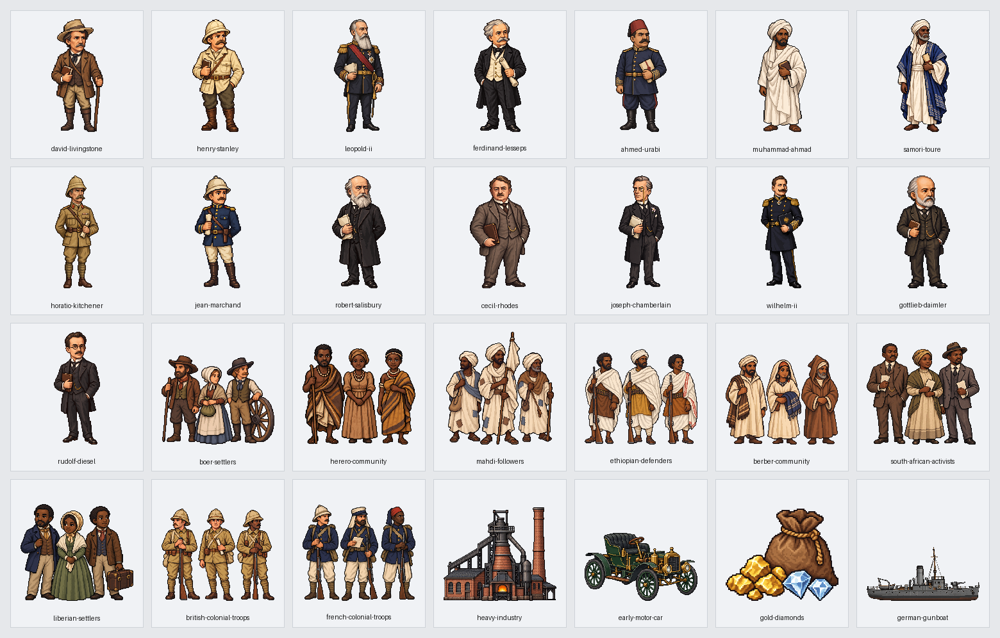

# 第11回「帝国主義とアフリカ分割」実装記録

第3章の第11回を、原書の4節122場面（22・55・18・27）で掲載する。原書199〜214ページの全16ページを保持し、第10回末尾と第11回冒頭を往復できる。版は v0.121。

## 参照専用の原文

参照先は sources/近代・現代/03_帝国主義と第一次世界大戦/11_帝国主義とアフリカ分割.md。SHA256は 46274fb1eae774d30ce9d96d54c12a29e68200018eac6e68266811f5876f3f11。全407行、通常本文65行を10紙面接続で55段落にする。表19行・補足41行と見出し・欄外・図の記号も全頁参照へ保持する。

紙面接続は48→64、98→116、136→142、161→177、191→197、211→227、263→279、291→303、321→337、349→355の10組。「ベルリン会議」「ダホメ王国」「ケープ植民地」「ドイツ」などの語中の改ページを、原文の文字・装飾・空白を足さず接続する。原文を編集せず、切り分け位置から全55段落を順序・重複・欠落なしで復元する。本文の太字352範囲・ルビ42範囲、色・下線と原書属性を保持する。

実際の節見出しは34・86・249・317行。209頁冒頭のファショダ事件・英仏協商は第2節、211頁冒頭の南アフリカ戦争・自治領・人種隔離は第3節である。上部の柱に先に出る節番号で本文の所属を切り替えない。199頁の第3章扉と200頁の回表紙、202頁の独占の形態、203頁以降のアフリカ分割の図と政治家の補足、214頁の年号・覚え方・次回予告を全文で表示する。本文に明記する原書121〜122頁は公開済み第6回の全頁参照へつなぐ。

55種類の説明図は「学習用の整理」と明示する。原文の当時の欧州側の呼称や差別と、その批判を文脈ごと残す。人種隔離の年代なども校訂せず原文の説明を保存する。説明図は原文の関係を整理するもので、原文にない年号を足さない。

## 地理とドット絵

名称224項目を国・地域・都市・河川・本人・集団・制度へ分け、個人の出生地や名前から居所を補わない。国籍や言語からその国の位置を補わず、アメリカ合衆国の「北部」をアフリカ北部にしない。文脈で省略された地域は、同じ親段落か直前の同じ節の本文から83場面・185地域記録へ静的に引き継ぎ、根拠行を記録する。共通の経度32度・緯度24度の拡大上限を保つ。

28新作は本人15点・一般集団9点・工場と自動車と資源と軍艦4点。同じ本人と一般的役割の既存14点も使い、全42点を122場面へ対応させる。ムハンマド＝アフマドと運動の一般の人びと、ヘレロの人びとと植民地軍、ブール人とエチオピアの兵士、現地のローズと本国のジョゼフ＝チェンバレンを混ぜない。ウラービーとオラービー、セシル＝ローズとローズは同じ本人の別表記。シャルル10世・モンロー・ビスマルクの辞任は過去の参照で、現在の会議や戦争へ同席させない。

指定のAntigravity CLI経由でGemini 3.8 Flashへ依頼したが、画像生成側の上限で画像が得られなかった。以前の利用者の代替ツール続行承認に基づき、組み込み画像生成で28点を制作した。指定経路のGeminiへ透過と192画素・透明余白の調整を依頼した。全依頼文・制作方法・保存先・元画像と出力の印は[画像の制作記録](image-assets.json)へ保存する。

## 出来事と実際の移動

実移動は8本。イギリス軍のエジプト→スーダン、フランス軍のジブチ→南スーダン、イギリス軍のスーダン→ファショダ、ブール人のケープ→ナタール、ナタール→トランスヴァールとナタール→オレンジの2分岐、本国から南アフリカへのイギリス軍派遣、地中海→タンジールへのヴィルヘルム2世の訪問を示す。本文の国・地域・都市の代表点間の概略方向であり、精密な道順や港・船の旅程は補わない。2共和国へ移住した全員が両方を順に訪ねたようには描かない。

3C政策はカイロ・カルカッタ・ケープタウンを結ぶ静的な構想の関係線3本。線に船や人物を走らせない。アガディールの軍艦は明記された到着地点で静止させ、皇帝本人を移動させたり出発港を補ったりしない。株式買収・運河の経営権・会議の承認・先占権・勢力範囲と旅行を区別する。ファショダの対峙は非交戦、仮定のフランス援軍は実現させず、英海軍の出動準備を出動に変えない。

ベルリン＝コンゴ会議と東方問題のベルリン会議、事実上の保護国と正式な保護国化、植民地と自治領、アパルトヘイトと非暴力運動を原文の説明に沿って読み分ける。

## 保存資料と確認

- source-selection.json：原文全407行と分類・55段落・10紙面接続。
- reading-plan.json：全122場面の原文位置と文脈地域の根拠。
- name-review.json・entity-audit.json：全名称と場面の題名・本文の対応。
- routes.json：実移動8本・構想の静的な関係線3本と原文根拠。
- visual-plan.json：42点の配置と本文・出典の印。
- image-assets.json：28新作の依頼文・保存先・透過と寸法・目視確認。

生成器は --workspace・--published・--check に対応する。本文検査は全行分類・全文復元・太字と色・下線・ルビ・表の空欄と順序・16頁と明記された他回2頁への到達・再生成を確認する。画像検査は全42点の存在・透過・余白・使用・本人と役割の取り違えを確認する。

画面確認は読み上げと音声再生を開く前に止め、全122場面を幅1280・390と明暗両方の488回表示で調べる。名前の不足・余分・重なり・はみ出し、原文参照の開閉、16頁と55図、目次・第10回との往復、実際の移動の始点・途中・終点・再表示・取消、権利と構想と出動準備の静止保持を対象にする。実行結果は[確認記録](validation.json)へ保存する。

2026年10月4日、v0.121の確認では全122場面の488回表示、原書16ページと本文に明記された第6回の2ページ、55種類の説明図、42画像を通過した。新作28点は顔・服装・本人と集団・役割・透過と余白を確認済み。本文全文・太字352範囲・ルビ42範囲・色と下線、図表・吹き出し・章扉・年号の全文、44回の原文参照、実移動8本の途中・到着・再表示・取消、3C政策を含む9場面の静止保持、目次と第10回との往復を確認した。軍艦の説明に陸軍を足さない絵の対応も照合した。読み込みエラー、名前の不足や余分、重なり、はみ出しは0件。第1回の252回表示、全体・公開用検査、原文付きと保存済み記録からの再生成一致も通過した。参照専用の原文60ファイルと、作業開始時の未確定ファイル2件は非改変。
