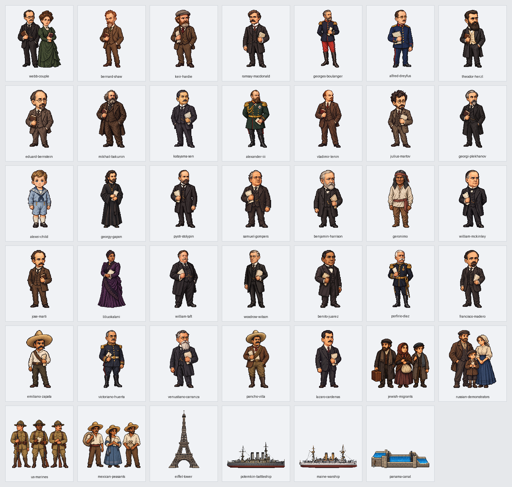

# 第12回「帝国主義時代の欧米諸国」実装記録

第3章の第12回を、原書の5節183場面（28・30・25・34・66）で掲載する。原書215〜235ページの全21ページを保持し、第11回末尾と第12回冒頭を往復できる。版は v0.122。

## 参照専用の原文

参照先は sources/近代・現代/03_帝国主義と第一次世界大戦/12_帝国主義時代の欧米諸国.md。SHA256は a081d0bbc3fd393b9f054213bf554bcc72ea6b2cf6f06263f72ca23589999215。全644行、通常本文96行を12紙面接続で84段落にする。表29行・補足107行と見出し・欄外・図の記号も全頁参照へ保持する。

紙面接続は41→49、71→87、259→275、294→300、348→354、392→408、418→426、502→508、524→540、552→560、574→590、600→608の12組。原文の文字・装飾・空白を足さず接続する。原文を編集せず、切り分け位置から全84段落を順序・重複・欠落なしで復元する。本文の太字594範囲・ルビ90範囲、色・下線と原書属性を保持する。色付きの部分と太字が重なる箇所では、装飾の開始と終了の順序を保って表示する。

実際の節見出しは27・91・213・288・412行。上部の柱に先に出る節番号で本文の所属を切り替えない。215頁の回表紙、各国の政治・政党の表、3B政策と3C政策の比較、図の文字と吹き出し、補足、235頁の年号・覚え方・次回予告を全文で表示する。本文に明記された原書47頁・117頁は公開済み第2回・第6回の全頁参照へつなぐ。

84種類の説明図は「学習用の整理」と明示する。原文の語り、批判、簡略な歴史説明を校訂せず保存し、原文にない年号を説明図へ加えない。急進社会党の名称と主義、ボリシェヴィキとメンシェヴィキの名称と実際の人数を区別する。

## 地理とドット絵

名称365項目を国・地域・都市・河川・本人・集団・制度へ分け、個人の出生地や名前から居所を補わない。国籍や言語からその国の位置を補わない。ワシントンはこの原文では都市として扱う。文脈で省略された地域は、同じ親段落か直前の同じ節の本文から114場面・206地域記録へ静的に引き継ぎ、根拠行を記録する。共通の経度32度・緯度24度の拡大上限を保つ。血の日曜日事件は、周辺を残す地理図とペテルブルク市内の説明図を併用する。

41新作は本人33点・一般集団4点・建物と軍艦と運河4点。ウェッブ夫妻は二人を一組で示す。同じ本人と一般的役割の既存37点も使い、全78点を183場面へ対応させる。亡命者・革命家・国の指導者・一般兵・請願者を混ぜない。アレクセイは子供、ガポンは請願を導く人物として区別する。ナポレオン1世・ヴィルヘルム1世・アレクサンドル2世・ペリーは過去の参照として示す。後世についての補足にあるヒトラーを、この時期に同席する人物として描かない。

指定のAntigravity CLI経由でGemini 3.8 Flashへ依頼したが、画像生成側の上限で画像が得られなかった。以前の利用者の代替ツール続行承認に基づき、組み込み画像生成で41点を制作した。指定経路のGeminiへ透過と192画素・透明余白の調整を依頼した。全依頼文・制作方法・保存先・元画像と出力の印は[画像の制作記録](image-assets.json)へ保存する。

## 出来事と実際の移動

実移動は8本。ブーランジェのパリ→ベルギーへの亡命、東欧からフランスへの一般の人びとの移住、米国→ニカラグアへの海兵隊派遣、米国→ハイチ・ドミニカ共和国・キューバの三つの派遣、フランス→メキシコへの軍隊派遣、米国→メキシコへの海兵隊派遣を示す。本文の国・地域・都市の代表点間の概略方向であり、精密な道順や港・船の旅程は補わない。三か国への派遣は並行する行き先で、同じ船の順番の航海にしない。フランスの軍隊とナポレオン3世本人を混ぜない。

3B政策はベルリン・イスタンブール・バグダード・ペルシア湾を結ぶ未完成の構想の静的な関係線3本。線に船や人物を走らせない。ポチョムキン号は黒海、メーン号はハバナで静止させ、知らない出港地を補わない。株式・投資・国際協力・労働運動・外交方針を人物の旅行と区別する。棍棒外交の脅し、パナマ運河がなければという仮定の航路、租借権と関税管理権、本文が追放先を示さないディアスの退陣を実移動にしない。

バーゼルのシオニスト会議を全移住者の出発地にしない。ロシア社会民主労働党の大会から特定の本人の旅程を補わない。血の日曜日事件の請願者、軍艦での反乱、議会と憲法の要求を同じ出来事へ混ぜない。ハワイの女王廃位と併合、日本の五港の開港権と実際の訪問を区別する。

## 保存資料と確認

- source-selection.json：原文全644行と分類・84段落・12紙面接続。
- reading-plan.json：全183場面の原文位置と文脈地域の根拠。
- name-review.json・entity-audit.json：全名称と場面の題名・本文の対応。
- routes.json：実移動8本・構想の静的な関係線3本と原文根拠。
- visual-plan.json：78点の配置と本文・出典の印。
- image-assets.json：41新作の依頼文・保存先・透過と寸法・確認記録。

生成器は --workspace・--published・--check に対応する。本文検査は全行分類・全文復元・太字と色・下線・ルビ・表の空欄と順序・21頁と明記された他回2頁への到達・再生成を確認する。画像検査は全78点の存在・透過・余白・使用・本人と役割の取り違えを確認する。

画面確認は読み上げと音声再生を開く前に止め、全183場面を幅1280・390と明暗両方の732回表示で調べる。名前の不足・余分・重なり・はみ出し、原文参照の開閉、21頁と84図、目次・第11回との往復、実際の移動の始点・途中・終点・再表示・取消、権利と構想と脅しと仮定の静止保持を対象にする。実行結果は[確認記録](validation.json)へ保存する。

2026年10月4日、v0.122の確認では全183場面の732回表示、原書21ページと本文に明記された第2回の47ページ・第6回の117ページ、84種類の説明図、78画像を通過した。新作41点は顔・服装・本人と集団・役割・透過と余白を確認済み。本文全文・太字594範囲・ルビ90範囲・色と下線、図表・吹き出し・回表紙・年号の全文、52回の原文参照、実移動8本の途中・到着・再表示・取消、3B政策を含む11場面の静止保持、目次と第11回との往復を確認した。読み込みエラー、名前の不足や余分、重なり、はみ出しは0件。第1回の252回表示、全体・公開用検査、原文付きと保存済み記録からの再生成一致も通過した。参照専用の原文60ファイルと、作業開始時の未確定ファイル2件は非改変。
