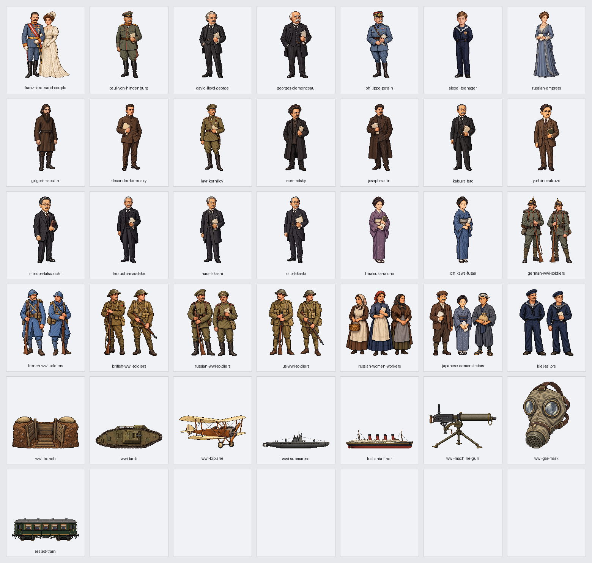

# 第13回「第一次世界大戦とロシア革命」実装記録

第3章の第13回を、原書4節と末尾の日本の関連欄の5教材205場面（90・28・34・39・14）で掲載する。原書236〜258頁の全23頁を保持し、第12回末尾と第13回冒頭を往復できる。版は v0.123。

## 参照専用の原文

参照先は sources/近代・現代/03_帝国主義と第一次世界大戦/13_第一次世界大戦とロシア革命.md。SHA256は 2b7b296d9009370b4b3e728f910c668bff8a0fb82883de7c39e4b70e93b8b752。全655行、通常本文93行を9紙面接続で84段落にする。表126行・補足23行と、見出し・章案内・図の記号も全頁参照へ保持する。

紙面接続は61→77、91→99、117→133、177→193、263→271、409→425、499→505、537→553、581→597の9組。文字・装飾・空白を足さず接続し、全84段落を欠落・重複なく復元する。本文の太字593範囲・ルビ88範囲、色と下線、背景、表の斜線の凡例を元の属性で保持する。

実際の見出しは28・301・405・507行、関連欄は643行。249頁のサライェヴォ事件と開戦は第2節、253頁冒頭の大戦終結は第3節。柱に先に出る節番号で本文の所属を切り替えない。回表紙、同盟とバルカン戦争の図表、戦線の凡例、補足コラム、257頁の年号・覚え方・次回予告、258頁の日本の大衆政治運動を保持する。本文の原書106〜107頁は公開済み第5回へ接続し、252頁からの256頁参照も保持する。

84種類の説明図には「学習用の整理」と付ける。原文の語り、批判、伝聞、戦争被害の人数を校訂せず、図の整理と区別する。原文にない年号を図へ加えない。

## 地理とドット絵

名称281項目を国・地域・都市・河川・本人・制度へ分ける。個人の出生地・国籍から居所を補わない。ペトログラードとペテルブルクは同じ地点の改称。シュリーフェン＝プラン・秘密外交の協定名・ロスチャイルド家は計画・協定・家として扱い、当該場面の本人を作らない。

文脈で省略された地域は、同じ親段落か直前の同じ節の本文から148場面・321地域記録へ静的に引き継ぎ、根拠行を保存する。共通の経度32度・緯度24度の拡大上限を維持し、同盟・戦争・革命の関係は説明図も併用する。

36新作は本人20点・一般集団8点・道具8点。同じ本人と一般的役割の既存19点も使い、全55点を205場面へ対応させる。夫妻は二人を一組、大戦期のアレクセイは少年の新作、袁世凱は政権期の既存絵で示す。一般の兵士・女性労働者・水兵・日本の大衆運動を名のある指導者と分ける。日本の運動に西洋の集団を流用しない。兵士の絵は大戦期の一般的な軍装で、特定の日・部隊の再現ではない。兵器・船・塹壕・封印列車は歴史的な模式図。

指定経路の画像生成が利用上限となったため、以前の利用者の承認に基づいて別の画像生成で制作した。透過・寸法・余白の調整は指定のAntigravity CLI経由でGemini 3.8 Flashへ依頼した。実際の依頼文・元画像・保存先・出力の印は[画像の制作記録](image-assets.json)へ保存する。

## 出来事と移動

実移動は6本。独軍のベルギー経由のフランス進攻、露軍のドイツ侵入、ヴィルヘルム2世のオランダ亡命、レーニンのスイスからロシアへの帰国とフィンランドへの逃亡、ケレンスキーのアメリカ亡命を示す。国の代表点間の方向で、精密な道順・港・部隊の前線・亡命都市を補わない。フランス代表点はパリ占領を意味せず、皇帝の亡命はベルリン発としない。レーニンの帰国に経由国や国境駅を補わない。ケレンスキーについての伝聞は原文のまま残し、伝聞を再現画で断定しない。

三帝同盟・三国同盟・三国協商は三つの静的な関係図9線。内容に合う説明を付け、旅行や進軍の印を付けない。会談、同盟・協商、秘密外交、宣戦、軍事計画、軍備の準備を実移動にしない。サライェヴォの夫妻、タンネンベルクの指揮官、キールの水兵、首都の女性労働者、富山の大衆運動は、原文の地点を静的に示す。

コルニーロフ軍の出発地、ルシタニア号の沈没地点や航路、米国の兵士の上陸港を補わない。米騒動の全国への拡大を同じ人びとの全国旅行として描かない。人物の居所が不明な場合は地図外で示す。

## 保存資料と確認

- source-selection.json：全655行・84段落・9紙面接続と分類。
- reading-plan.json：205場面の原文位置・文脈地域の根拠。
- name-review.json・entity-audit.json：名称と題名・本文の対応。
- routes.json：実移動6本・関係線9本と原文根拠。
- visual-plan.json：55点の配置と本文・出典の印。
- image-assets.json：36新作の依頼文・保存先・透過・寸法。

本文検査では全文復元、全行分類、太字・色・下線・ルビ、図表の空欄と順序、23頁と明記された他回2頁への到達、再生成を確認する。画像検査では全55点の存在・透過・余白・使用、本人と一般集団、静止と実移動を照合する。

画面を開く前に読み上げと音声再生を止め、全205場面を幅1280・390、明暗両方の820回表示で確認する。名前の不足・余分・重なり・はみ出し、原文参照、全84図、目次・第12回との往復、通常再生・途中・到着・再表示・取消と静止保持を確認する。実行結果は[確認記録](validation.json)へ保存する。

2026年10月4日、v0.123では全205場面の820回表示、原書23頁と明記された第5回の106〜107頁、84種類の説明図、55画像を確認した。新作36点の顔・服装・本人と集団・役割・透過と余白を目視済み。本文全文・太字593範囲・ルビ88範囲・色と下線・背景、図表・吹き出し・コラム・年号・関連欄を保持し、80回の原文参照、実移動6本の途中・到着・再表示・取消、17場面の静止保持、目次と第12回との往復を通過した。読み込みエラー、名前の不足・余分、重なり、はみ出しは0件。第1回の252回表示、全体・公開用検査、原文付きと保存済み記録からの再生成一致も通過。原文60ファイルと作業開始時の未確定ファイル2件は非改変。
