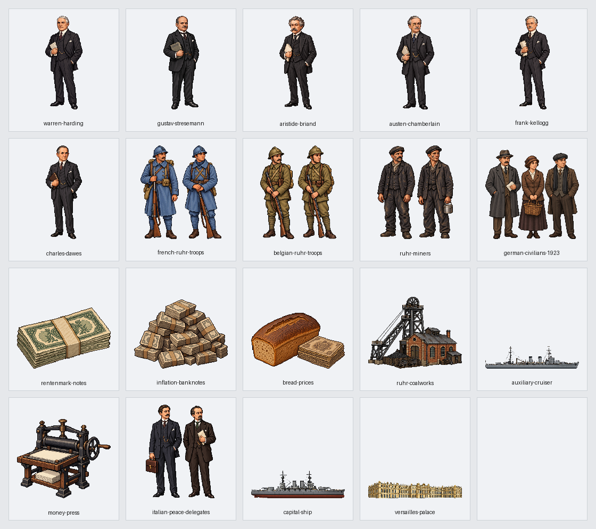

# 第14回「ヴェルサイユ体制とワシントン体制」実装記録

第4章「戦間期と第二次世界大戦」の入口として、第14回を4教材153場面（53・15・37・48）で掲載する。原書259〜274頁の全16頁と章扉・回表紙を保持し、第13回末尾と第14回冒頭を往復できる。版は v0.124。

## 参照専用の原文

参照先は sources/近代・現代/04_戦間期と第二次世界大戦/14_ヴェルサイユ体制とワシントン体制.md。SHA256は 8d397d44e81b32b763d55534b612851c3fff91c30d7008ed4883567853bc17c2。全465行、通常本文61行を4紙面接続で57段落にする。表120行・補足9行と、見出し・柱・章案内・図の記号も全頁参照へ保持する。

紙面接続は112→128、292→298、374→392、427→445の4組。文字・装飾・空白を足さず接続し、全57段落を欠落・重複なく復元する。本文の太字369範囲・ルビ44範囲、色・下線・背景を元の属性で保持する。国際連盟の表の丸囲みと不参加国の抹消線、資金図の丸囲み・方向記号・改行、領土の図の空欄と凡例も保持する。

実際の見出しは35・201・252・336行。267頁の国際連盟の問題点は第2節、270頁冒頭の戦後体制の比較は第3節。柱に先に出る節番号で本文所属を切り替えない。259頁の第4章扉・260頁の回表紙、和平案・講和条約・新興独立国・国際連盟の機構と問題点・軍縮比率・ドーズ案の資金図・年号と覚え方・次回予告を全16頁参照へ残す。本文に明記されない他回の原書参照は補わない。

57種類の説明図には「学習用の整理」と付ける。原文の語り、批判、簡略な歴史説明、賠償額や物価の数字を校訂しない。「1320億金マルク」「358億金マルク」「パン1兆マルク」などの説明には原書の数字であることを明記する。調印、設立決定、発足、正式加盟の年を区別する。ドーズ案の賠償総額非減額と当面の年額軽減も区別する。

## 地理とドット絵

名称175項目を国・地域・都市・河川・本人・制度へ分ける。国名の組み合わせ「英仏」「米英」「独仏」なども対応させる。個人の国籍や出生地から居所を補わず、民族名だけを所在地にしない。ドーズ案・ドーズ委員会・ヤング案、ケロッグ・ブリアン条約や石井・ランシング協定を、当該場面での本人の登場にしない。民間財政家と明記された本文のドーズは本人の絵で示す。オースティン＝チェンバレンを同姓の別人へ対応させない。

文脈で省略された地域は、同じ親段落か直前の同じ節の本文から117場面・369地域記録へ静的に引き継ぎ、根拠行を保存する。共通の経度32度・緯度24度の拡大上限を維持し、講和・軍備・協調・資金の関係は説明図も併用する。

新作19点は本人6・一般集団5・道具と建物8。同じ本人と一般的な役割の既存16点も使い、全35点を153場面へ対応させる。フランス軍とベルギー軍、鉱山労働者、一般の市民、講和代表を名のある指導者と分ける。主力艦と補助艦、禁止された兵器と稼働中の兵器を区別する。宮殿には、この回専用の横に広がる古典様式の新作を使い、以前の画像は上書きしない。軍装・紙幣・艦船・建物は学習用の模式図で、特定の部隊や実物の精密な復元ではない。

指定経路の画像生成では認証エラーが記録され、生成済み画像を取得できなかったため、以前の利用者の承認に基づいて別の画像生成で制作した。透過・寸法・余白の調整は指定のAntigravity CLI経由でGemini 3.8 Flashへ依頼した。実際の依頼文・元画像・保存先・出力の印は[画像の制作記録](image-assets.json)へ保存する。

## 出来事と移動

実移動は3本。パリ講和会議からの一般のイタリア代表の一時帰国、フランス軍とベルギー軍のルールへの出兵を示す。国・地域の代表点間の概略方向で、実際の基地・帰国都市・軍道・特定の代表本人を補わない。横に広がるヴェルサイユ宮殿は、地図で位置を示し、姿を地図外の模式図へ分ける。宮殿・主力艦・補助艦は横長専用の枠で拡大し、実際の描画部分を切り落とさず、携帯幅でも形の違いを読み取れる寸法で表示する。ルールの鉱工業は地域の代表点で静的に示す。フランスの撤兵には本文にない撤退先や旅程を作らない。

ドーズ案は米→独の民間投資、独→英・仏の賠償金、英・仏→米の戦債という5本の静的な資金関係線にする。説明図では三つの資金の種類と向きを示す。地理図の関係線に人・軍隊・輸送の印を走らせない。講和、割譲、委任統治、港湾使用権、相互承認、国際連盟の発足や正式加盟、主力艦・補助艦の保有比率を人や船の旅程へ読み替えない。

## 保存資料と確認

- source-selection.json：全465行・57段落・4紙面接続と分類。
- reading-plan.json：153場面の原文位置・文脈地域の根拠。
- name-review.json・entity-audit.json：名称と題名・本文の対応。
- routes.json：実移動3本・資金関係5線と原文根拠。
- visual-plan.json：35点の配置と本文・出典の印。
- image-assets.json：19新作の依頼文・保存先・透過・寸法。

本文検査では全文復元、全行分類、太字・色・下線・ルビ、章扉、丸囲み・抹消線・資金記号、図表の空欄と順序、16頁への到達、再生成を確認する。画像検査では全35点の存在・透過・余白・使用、本人と一般集団、静止と実移動を照合する。

画面を開く前に読み上げと音声再生を止め、全153場面を幅1280・390、明暗両方の612回表示で確認する。名前の不足・余分・重なり・はみ出し、原文参照、全57図、目次・第13回との往復、通常再生・途中・到着・再表示・取消と静止保持を確認する。実行結果は[確認記録](validation.json)へ保存する。

2026年10月4日、v0.124では全153場面の612回表示、原書16頁、57種類の説明図、35画像を確認した。新作19点の顔・服装・本人と集団・役割・透過と余白を目視済み。本文全文・太字369範囲・ルビ44範囲・色と下線・背景、章扉・回表紙・図表・吹き出し・年号・予告を保持し、88回の原文参照、実移動3本の途中・到着・再表示・取消、20場面の静止保持、5本の静的な資金関係線、目次と第13回との往復を通過した。読み込みエラー、名前の不足・余分、重なり、はみ出しは0件。第1回の252回表示、全体・公開用検査、原文付きと保存済み記録からの再生成一致も通過。原文60ファイルと作業開始時の未確定ファイル2件は非改変。
