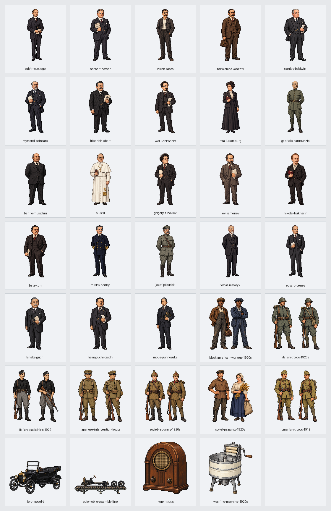

# 第15回「戦間期の欧米諸国 〜世界恐慌以前〜」実装記録

第4章の第15回を、欧米6節と日本の関連欄の7教材229場面（47・28・32・36・57・14・15）で掲載する。原書275〜292頁の全18頁を保持する。版はv0.125。第14回末尾と第15回冒頭を往復でき、近代・現代は67節1814場面、全体は195教材2827場面。

## 参照専用の原文

参照先は sources/近代・現代/04_戦間期と第二次世界大戦/15_戦間期の欧米諸国_世界恐慌以前.md。SHA256は a41691ce04c38fceb2e201e84821e8040ca88ac5442ff65bbc7b8a2a51fc52b8。全538行、通常本文89行、表21行、補足94行を保持する。通常本文79段落を欠落・重複なく復元する。本文の太字507範囲・読み仮名89範囲、色・下線・背景・読みの字句を元の属性で保持する。290頁の政策比較の二重下線も保持する。

紙面接続は46→52、66→82、98→104、122→138、179→195、214→220、258→274、310→326、418→424、478→484の10組。文字・装飾・空白を足さず接続する。388行と404行のネップの説明は別々の段落として保つ。実際の見出しは28・90・148・222・330・474・526行。283頁の冒頭のドイツ復興は第3節に保ち、頁上部の柱で本文の所属を変えない。通常は文・発話末で区切り、308行「併合すると、」と374行「北からペトログラードなどを脅かし、」のみ、出来事と戦域の違いで分ける。

回表紙、全表・図内の文字・吹き出し・コラム・年号と覚え方・次回予告を全18頁参照へ保持する。本文に明記されたP.47・P.50〜51は第2回の原書参照へ接続する。末尾の日本の金本位制、大戦景気、戦後恐慌、金融恐慌、井上財政の5段落も全文で掲載する。原文の数字・簡略な説明・語り口と差別や暴力への批判を校訂しない。79種類の図解には「学習用の整理」と付け、共和国の数や被害の数字などは原文の説明と区別する。

## 地理とドット絵

名称260項目を国・地域・都市・河川・本人・制度へ分ける。同じ親段落か直前の同じ節の本文から、162場面・328地域の文脈記録へ静的に引き継ぎ、根拠行と理由を保存する。国籍・民族名・チェコ兵捕虜から居所を補わない。会社・事件・制度・王家を当該場面の本人にしない。ガリバルディとヴィルヘルム2世は過去の回想、ベネシュの時代の侵略などは1930年代の先取りとして分ける。

新作34点は本人23・一般集団7・道具4。既存の同じ本人・役割の27点も使い、61点を全229場面へ対応させる。T型フォード、流れ作業、ラジオ、初期の洗濯機も収録する。流れ作業の絵は携帯幅で小さく見えたため、横長の専用枠へ変更した。第15回専用の表示指定で横幅256画素まで広げ、透過部分を除く描画幅120・高さ24画素以上と切れ・重なり・はみ出しを検査する。黒人労働者を奴隷の姿にせず、黒シャツ隊と正規軍、赤軍と外国の干渉軍、指導者本人と一般の集団を区別する。軍装・道具は模式図であり、精密な実物復元や本人確認済みの肖像ではない。

指定の画像生成経路では認証エラーが記録され、生成済み画像を取得できなかったため、以前の利用者の承認に基づいて別の画像生成で制作した。今回の整形依頼も実行結果が得られず、前回Geminiが作成した処理用プログラムを再利用して、寸法・透過・余白を揃えた。ヒトラー本人の肖像だけは画像生成側の出力審査で作成できず、名前・原文・図解で示す。別人の顔を代用しない。依頼文、元画像、保存先、原画像と出力の印は[画像の制作記録](image-assets.json)へ保存する。

## 出来事と移動

実移動は8概略動線。黒シャツ隊の北部・中部からローマへの2動線、イタリアのアルバニア派兵、英仏のムルマンスク上陸2動線、日米のシベリア出兵2動線、ルーマニア軍のハンガリー侵入。国・地域の代表点間の方向で、実際の基地・港・軍道や捕虜の位置を補わない。ムッソリーニ本人を隊員と同じ旅程に置かず、ムルマンスク上陸をペトログラードへの到着や占領にしない。フィウメ占領は出発地が不明なので静的な軍人の参照にする。

金融の中心の交代2場面、フランスの同盟・小協商支援5関係、小協商内部の3関係は、説明を付けた10本の静止した線にする。現金輸送や使節の旅程にしない。黒人労働者の移住、トロツキーの追放と後の暗殺、農民の追放、ポーランドの戦線、撤退には不明な地点・経由地を補わない。地理図の共通拡大上限（経度32度・緯度24度）は変更しない。

## 保存資料と確認

- source-selection.json：全538行・79段落・10紙面接続と分類。
- reading-plan.json：229場面の原文位置・文脈地域の根拠。
- name-review.json・entity-audit.json：名称と題名・本文の対応。
- routes.json：8動線・10関係線と原文根拠。
- visual-plan.json：61点の配置、本人と文字で示す人物、本文・出典の印。
- image-assets.json：34新作と未生成1点の依頼文・保存先・透過・寸法・制約。

本文検査で全文復元、全行分類、装飾と読み仮名、二重下線、図表の空欄と順序、全18頁と明示された他回3頁への到達、再生成を確認する。画像検査で全61点の存在・透過・余白・使用、本人と一般集団、静止と移動の対応を照合する。

画面を開く前に読み上げと音声再生を止め、全229場面を幅1280・390、明暗両方の916回表示で確認する。名前の不足・余分・重なり・はみ出し、31重要参照の124回の開閉、全79図、2巻の目次、第14回との往復、通常再生・途中・到着・再表示・取消、静止保持を検査する。実際の実行結果は[確認記録](validation.json)へ保存する。

2026年10月4日、v0.125では全229場面の916回表示、原書18頁、79種類の説明図、61画像を確認した。新作34点の本人と一般集団・服装・役割・透過と余白を目視済み。本文全文・太字507範囲・ルビ89範囲・色と下線・二重下線・背景、回表紙・図表・吹き出し・年号・次回予告を保持し、31重要参照の124回の開閉、明示された他回3頁、実移動8本の途中・到着・再表示・取消、28場面の静止保持、10本の金融・外交の静的関係線、目次と第14回との往復を通過した。読み込みエラー、名前の不足・余分、重なり、はみ出しは0件。第1回の252回表示、全体・公開用検査、原文付きと保存済み記録からの再生成一致も通過。原文60ファイルと作業開始時の未確定ファイル2件は非改変。ヒトラー本人の肖像は生成側の出力審査により作成できず、名前・原文・図解で表示する。
